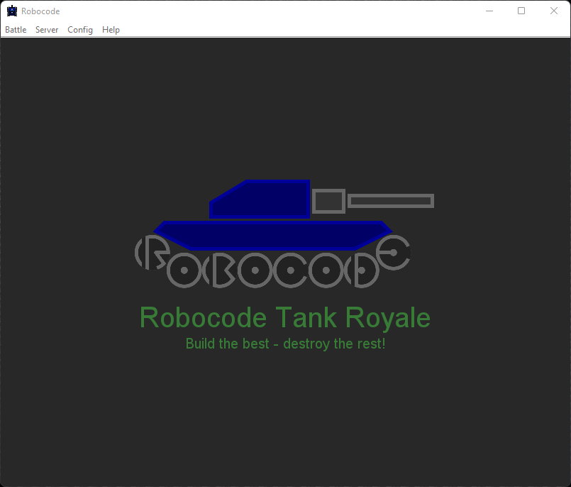
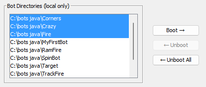
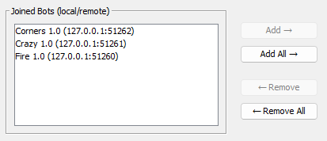
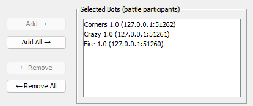

# GUI application

The **GUI application** is a graphical user interface for Robocode Tank Royale that allows you to:

- Connect to a server running locally, or start up a new server that will run locally.
- Startup battles with selected bots and define the rules to apply for the battle.
- Boot up bots locally, or let remote bots join your battle.
- View battles in the battle arena and control the visualization speed.

## Start window

When starting up the GUI application, this window is the first thing you will see:

Use the menu at the top, which contains some keyboard shortcuts for the main features. For example `Ctrl+B` for starting
a new battle.

## Start the battle

The main feature of the GUI application is starting a new battle and selecting the bots to participate in the battle.

The window contains these four lists:

- Bot Directories (local)
- Booted Bots (local)
- Joined Bots (local/remote)
- Selected Bots (battle participants)

Besides these lists, the window contains 'Set game rules and type' at the top to select the [game type] for the battle:

At the bottom of the window, the _bot info_ is displayed for the bot when selecting a bot within the 'Bot Directories'
list:

### Bot Directories

The **Bot Directories** lists all the bots types found in the local (root) bot directories that you have added to
the configuration. Each entry in the list contains the absolute file path to a bot type.

When no bot directories have been set up already, a dialog will show up, telling you that you need to set up at least
one bot directory root.

To begin with, you can download the zip files with the sample bots. Unzip those to some directory, which you then add to
the configuration from the menu with the Config → Bot Root Directories:

### Booted Bots

The **Booted Bots** lists all bots that have been booted up from the GUI. The GUI has the [booter] built-in, which
is used for booting up selected bots from the Bot Directories.

Note that it is possible to boot up multiple instances of
the same bot type, so you can, for example, let 3 Corners bots battle each other.

Each entry in the Booted Bots list contains the full file path for the bot type of the booted bot plus a process id
within the parentheses after the file path.

When pressing 'Boot', a process will start-up running the individual bot selected from the Bot Directories.
When pressing 'Unboot' the process for the selected bot will be stopped (or killed).

### Joined Bots

The **Joined Bots** lists all bots that have joined the server locally or remotely, and hence are available for the
battle. If you start a bot from the command line or within an IDE locally, it will also show up in the **Joined Bots**
list.

Note that the server and GUI do not know the file path of the joined bots as the [booter] is not involved in
this part. From the server´s perspective, the bots are joining on the server´s WebSocket. And the information about
the bot is provided by the _bot handshake_ only at this point. The server cannot tell if a bot has joined from your
local machine or remotely from outside either.

### Selected Bots

The **Selected Bots** lists the joined bots you are selecting to participate in the battle.

Note that the 'Start Battle' button will be disabled if the number of selected bots for the battle does not meet the
minimum requirements defined by the rules ([game type]).

## Setup Rules

It is possible to modify the rules for a specific [game type] for a battle similar to the original Robocode.

Currently, these predefined game types exist: `classic`, `melee`, and `1v1`. But there is also a `custom` which you
can use it for your purpose to experiment with the settings as you please.

Rule settings:

| Rule                        | Description                                                                                                                                                                              |
|:----------------------------|:-----------------------------------------------------------------------------------------------------------------------------------------------------------------------------------------|
| Min. Number of Participants | The minimum number of participants required to play the battle.                                                                                                                          |
| Max. Number of Participants | The maximum number of participants allowed to play the battle.                                                                                                                           |
| Number of rounds            | The number of rounds before the game is ended, and game results will show up.                                                                                                            |
| Gun cooling rate            | The decrease of heat per round. The bigger, the faster the gun will cool down.                                                                                                           |
| Max. Inactivity Turns       | The number of turns allowed where no bots have been hit before the game will punish the remaining bots in the arena by decreasing their energy each turn.                                | 
| Ready timeout               | The maximum number of microseconds a bot is allowed before the server must have received a 'Bot Ready' message from the bot. Otherwise, the bot is automatically kicked from the battle. |
| Turn timeout                | The maximum number of microseconds a bot is allowed before the server must have received a 'Bot Intent' message from the bot. Otherwise, the bot will skip the turn. [^skip-turn]        |

## Server Log

When the GUI is used for starting a server it is possible to view the server log from the menu.

## Select Server

It is possible to change which server the GUI is connecting to from the menu:

You can add URLs to multiple Robocode servers. The current selected URL will be the server that the GUI will use. And
you can test if the server is running with the Test button.

[game type]: game_types.md

[booter]: booter.md

[^skip-turn]: ? "When a bot is skipping a turn, it is unable to change its speed or turning rates, and will continue
using the speed and turn rates from the last commands successfully sent to the server.
