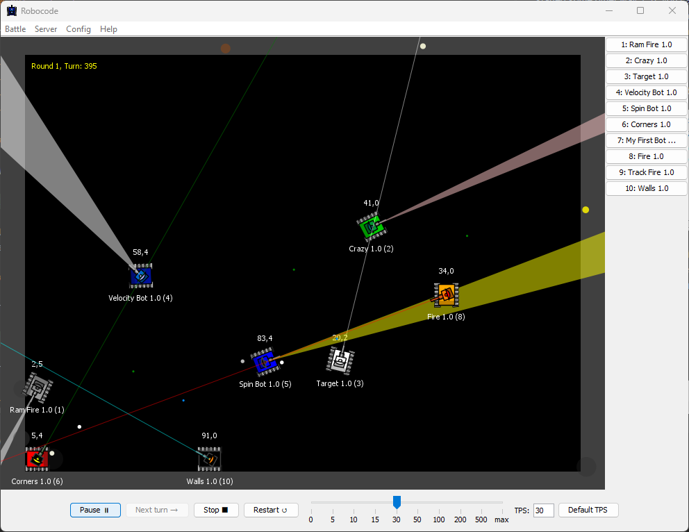
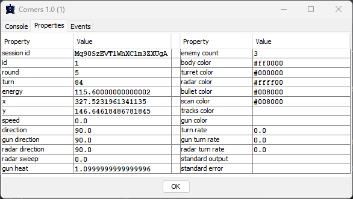
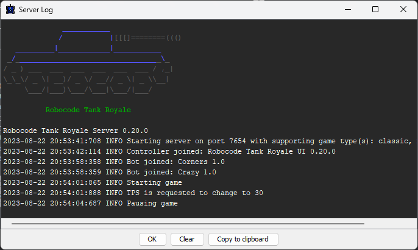
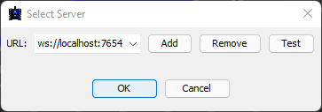
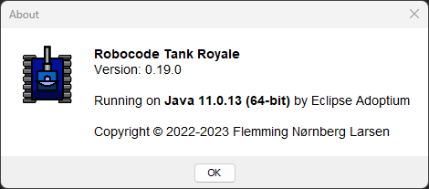

# GUI application

## Introduction

The **GUI application** is a graphical user interface for Robocode Tank Royale that allows you to:

- Connect to a server running locally, or start up a new server that will run locally.
- Startup battles with selected bots and define the rules to apply for the battle.
- Boot up bots locally, or let remote bots join your battle.
- View battles in the battle arena and control the visualization speed.

## Start window

When starting up the GUI application, this window is the first thing you will see:

Use the menu at the top, which contains some keyboard shortcuts for the main features. For example `Ctrl+B` for starting
a new battle.

## Starting a battle

The main feature of the GUI application is starting a new battle and selecting the bots to participate in the battle.

The window contains these four lists:

- Bot Directories (local)
- Booted Bots (local)
- Joined Bots (local/remote)
- Selected Bots (battle participants)

Besides these lists, the window contains 'Select game type' at the top to select the [game type] for the battle.
Note that you can adjust the rules for a specific game type by clicking the 'Setup Rules' button.

At the bottom of the window, the _bot info_ is displayed for the bot when selecting a bot within the 'Bot Directories'
list:

### Bot Directories

The **Bot Directories** lists all the bots types found in the local (root) bot directories that you have added to
the configuration. Each entry in the list contains the absolute file path to a bot type.

When no bot directories have been set up already, a dialog will show up, telling you that you need to set up at least
one bot directory root.

To begin with, you can download the zip files with the sample bots. Unzip those to some directory, which you then add to
the configuration from the menu with the Config → Bot Root Directories:

### Booted Bots

The **Booted Bots** lists all bots that have been booted up from the GUI. The GUI has the [booter] built-in, which
is used for booting up selected bots from the Bot Directories.

Note that it is possible to boot up multiple instances of
the same bot type, so you can, for example, let 3 Corners bots battle each other.

Each entry in the Booted Bots list contains the full file path for the bot type of the booted bot plus a process id
(pid) within the parentheses after the file path.

When pressing 'Boot', a boot process will start up running the individual bots selected from the Bot Directories. Note
that the bots themselves are running in their own processes (and own pid) beside the boot process listed in the list of
booted bots.

When pressing 'Unboot' the boot process of the selected bot will be stopped, which is effectively stopping the bot as
well.

### Joined Bots

The **Joined Bots** lists all bots that have joined the server either locally or remotely, and hence are available for
the battle. If you start a bot from the command line or within an IDE locally, it will also show up in the **Joined
Bots** list.

The IP address and port for the joined bot is written in the parentheses, which also makes it possible to differ between
multiple instances of the same bot, e.g. if Corners have been booted multiple times.

Note that the file path of the bot is not available is the list of **Joined Bots**. The reason is that the server only
listens for bots that join via the server´s WebSocket, and hence only knows the IP address and port, and the bot
information provided via the _bot handshake_ sent by the bot itself.

The booter (used by the GUI) does have this knowledge, _but only for bots that was started from the local file system_.
Be aware that bots might not make use of the booter at all, but could be started some other way. E.g. you can write a
Bot application running against the server's WebSocket with or without using the provided bot APIs, and just start it
up from some process, or running within e.g. an application server locally or remotely.

### Selected Bots

The **Selected Bots** lists the joined bots you are selecting to participate in the battle.

Note that the 'Start Battle' button might be disabled if the number of selected bots for the battle does not meet the
minimum requirements defined by the rules ([game type]), which is written in hover text for the 'Start Battle' button.

## Viewing the battle

When the battle is started, the screen will shift to the battle view:

The battle can be controlled using the control panel at the bottom:

With the control panel you can:

- pause/resume the battle
- single-step a turn by clicking 'Next turn', while the game is paused
- stop and restart the battle
- set the TPS (Turns per second) with the slider, TPS field, or the default TPS button

### Viewing the bot console

On the left side of the battle view you can see a side-panel containing buttons for each bot participating in the
battle:

When clicking on a 'bot button', the bot console window will open:

On the **Console** tab of the bot console writes out the standard output (stdout) and standard error (stderr) printed
out from the bots standout
output streams. Note that the standard output streams from the bot is being redirected by the Bot API when it is being
booted from the [Booter].

Data received from the bot is written out with a label in gray with the turn number, when the
output was written out.

Messages sent to standard output (stdout) is written in white, and messages sent to standard
error (stderr) is written out in red.

Info messages from the game (GUI) is written out in green. Info messages is e.g. round
number, when a new round has just started. But it could also be "events" written out with a starting left arrow (>)
telling that the game has ended or was aborted.

### Viewing the bot properties

The **Properties** tab of the bot console shows all the current bot properties for the current turn, which is useful
to read the current states of the bot and useful debugging your bot.

## Setup Rules

Setup Rules makes it is possible to modify the rules for a specific [game type]:

Currently, these predefined game types exist: `classic`, `melee`, and `1v1`. But there is also a `custom` which you
can use it for your own purpose to experiment with the settings as you please.

Rule settings:

| Rule                        | Description                                                                                                                                                                              |
|:----------------------------|:-----------------------------------------------------------------------------------------------------------------------------------------------------------------------------------------|
| Min. Number of Participants | The minimum number of participants required to play the battle.                                                                                                                          |
| Max. Number of Participants | The maximum number of participants allowed to play the battle.                                                                                                                           |
| Number of rounds            | The number of rounds before the game is ended, and game results will show up.                                                                                                            |
| Gun cooling rate            | The decrease of heat per round. The bigger, the faster the gun will cool down.                                                                                                           |
| Max. Inactivity Turns       | The number of turns allowed where no bots have been hit before the game will punish the remaining bots in the arena by decreasing their energy each turn.                                | 
| Ready timeout               | The maximum number of microseconds a bot is allowed before the server must have received a 'Bot Ready' message from the bot. Otherwise, the bot is automatically kicked from the battle. |
| Turn timeout                | The maximum number of microseconds a bot is allowed before the server must have received a 'Bot Intent' message from the bot. Otherwise, the bot will skip the turn. [^skip-turn]        |

## Server Log

When the GUI is used for starting a server it is possible to view the server log from the menu.

## Select Server

It is possible to change which server the GUI is connecting to from the menu:

You can add URLs to multiple Robocode servers. The current selected URL will be the server that the GUI will use. And
you can test if the server is running with the Test button.

## Debug Options

The current **Debug Options** contains a single option for enabling _initial start position_ for a bot, meaning that if
a
bot has set the `initialPosition` field in the JSON config file or programmatically via the `BotInfo` class, then the
bot will be allowed to use the specified starting position.

Note that this is an exception to the rule, as bots are not normally allowed to set a starting position. But the
exception here is for debugging purposes only.

## Sound Options

The **Sound Options** let you enable and disable sounds, but also toggle the individual sound effect.

## About box

The about-box provides information about the version of the GUI application and built in booter and server.

In addition, the Java version and vendor is also provided, which is useful information when e.g. filing a bug report.

[^skip-turn]: ? "When a bot is skipping a turn, it is unable to change its speed or turning rates, and will continue
using the speed and turn rates from the last commands successfully sent to the server."

[game type]: game_types.md

[booter]: booter.md